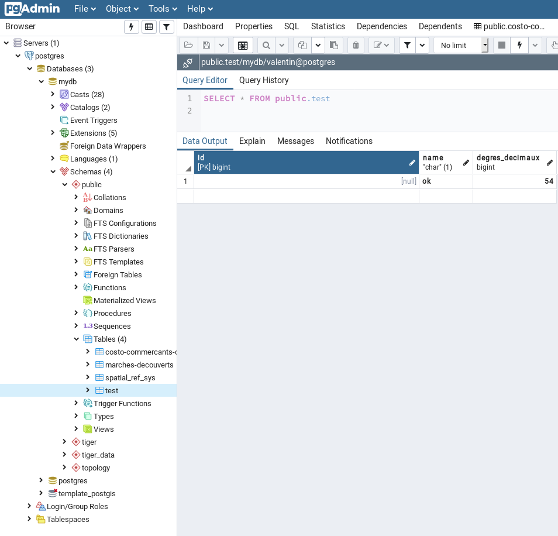
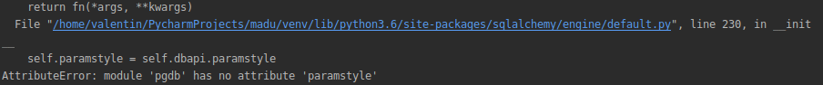
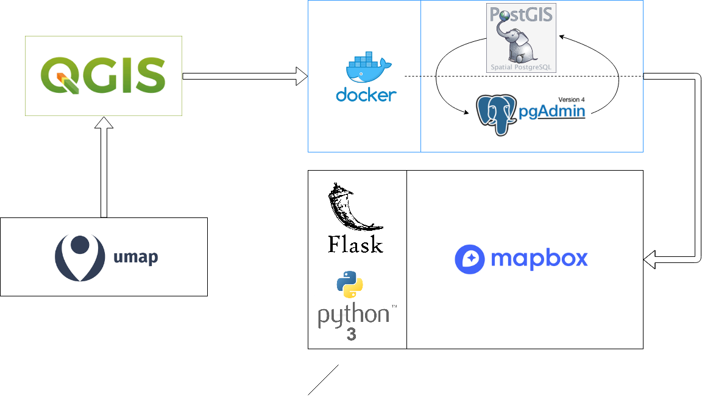
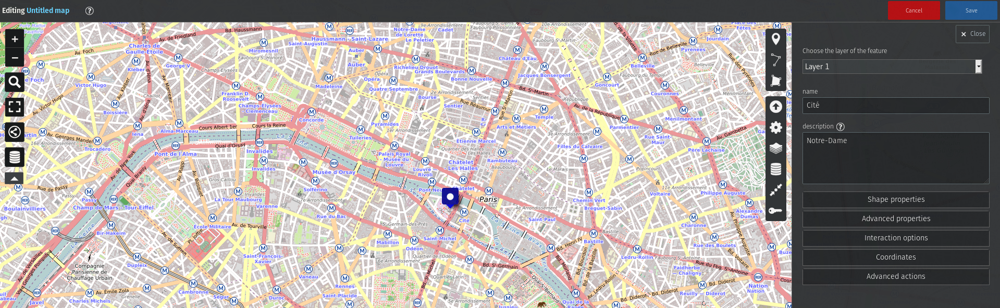
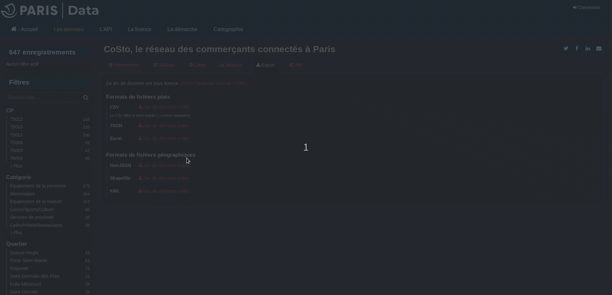
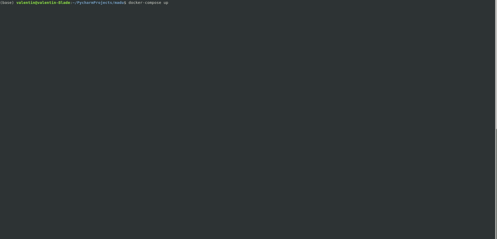

# MADU 


**Ce projet a été réalisé dans le cadre du hackathon de l'ECV digital**
                                                                       
              _______  _______  _        _______ _________          _______  _                  
    |\     /|(  ___  )(  ____ \| \    /\(  ___  )\__   __/|\     /|(  ___  )( (    /|           
    | )   ( || (   ) || (    \/|  \  / /| (   ) |   ) (   | )   ( || (   ) ||  \  ( |           
    | (___) || (___) || |      |  (_/ / | (___) |   | |   | (___) || |   | ||   \ | |           
    |  ___  ||  ___  || |      |   _ (  |  ___  |   | |   |  ___  || |   | || (\ \) |           
    | (   ) || (   ) || |      |  ( \ \ | (   ) |   | |   | (   ) || |   | || | \   |           
    | )   ( || )   ( || (____/\|  /  \ \| )   ( |   | |   | )   ( || (___) || )  \  |           
    |/     \||/     \|(_______/|_/    \/|/     \|   )_(   |/     \|(_______)|/    )_)           
                                                                                                
     _______  _______             ______  _________ _______ __________________ _______  _       
    (  ____ \(  ____ \|\     /|  (  __  \ \__   __/(  ____ \\__   __/\__   __/(  ___  )( \      
    | (    \/| (    \/| )   ( |  | (  \  )   ) (   | (    \/   ) (      ) (   | (   ) || (      
    | (__    | |      | |   | |  | |   ) |   | |   | |         | |      | |   | (___) || |      
    |  __)   | |      ( (   ) )  | |   | |   | |   | | ____    | |      | |   |  ___  || |      
    | (      | |       \ \_/ /   | |   ) |   | |   | | \_  )   | |      | |   | (   ) || |      
    | (____/\| (____/\  \   /    | (__/  )___) (___| (___) |___) (___   | |   | )   ( || (____/\
    (_______/(_______/   \_/     (______/ \_______/(_______)\_______/   )_(   |/     \|(_______/
                                                                                            
                                                                                                                                                     
Groupe 6 :

- GUILBAUD Valentin_____M1 DEV
- VENCO Antoine_________M2 WD
- KHUNJA Myriam_________M2 WM
- PÂQUET Bérénice_______M1 UX
- BERGERON Steven_______M2 UX


## Choix des technos

Soyons honnêtes, étant le seul développeur dans mon groupe, je ne me suis pas privé de quelques fantasies.
J'ai donc décidé de travailler soit sur des technologies que je "maitrise" et que je souhaite approfondir :
- Python
- Flask
- Docker

Soit sur des technologies sur lesquels je n'ai pas encore eu la chance de travailler (ou tout du moins pas en profondeur) :
- SQLAlchemy
- Postgres
- Postgis
- pgadmin
- Mapbox
- Umap
- Qgis 


En termes plus technique, mon choix est tout de même réfléchi :
- Python s'oriente vers le traitement du big data, vi à vi de la cartographie de lieux dans le monde, ce choix me semblait pertinent.

- N'ayant que peu de temps et souhaitant réalisé un CRUD afin de pouvoir insérer facilement de nouvelles coordonnées dans une BDD, Flask se trouve être le framework parfait. Simple et très léger, grace à lui je vais pouvoir réaliser beaucoup de features plus ou moins complexe en peu de temps.

- En ce qui concerne Docker, ce n'est rien de plus qu'un caprice de ma part. Docker n'est pas viable en ce qui concerne les petis projets, en revanche si l'application venait à grossir, la question d'utiliser Docker pourrai bien se poser.

- Après quelques renseignement, prosgresql se trouve être la BDD parfaite pour le traitement de nombreuses coordonnées sur une carte. Le souci de la rapidité étant un des points les plus importants soulevé par l'intervenante, le choix fut rapidement fait.

- L'utilisation de Postgis et de Qgis s'insèrent dans la même logique. Qgis fesant écho à postgis, il n'était pas concevable de passer à coté.

-------
**Ayant réalisé un gros travail d'infrastructure et ne pouvant le rendre comme un code à push sur git, ce README sera généreusement garni de screenshoot accompagnés d'explications décrivant mes démarches.**

## Développement Docker/Flask/Postgresql pour le CRUD

Après l'innitialisation de mon projet Flask, j'ai écris un `.gitignore` pour éviter tout conflits en cas de coworking du le projet.

Dans le cadre du projet, j'ai tout d'abord mis en place un conteneur docker `Postgresql` via dockerhub :
https://hub.docker.com/_/postgres

```
docker run -it --rm --network some-network postgres psql -h some-postgres -U postgre
```



Par la suite, j'ai modifier l'image pour finalement utilisé une image `postgis` couplé à une image `pgadmin` en concordance avec Qgis que j'utiliserai plus tard :
https://hub.docker.com/r/mdillon/postgis

J'ai ensuite réalisé un fichier  `docker-compose.yaml` afin de pouvoir résalisé un montage rapide des conteneurs postgis et pgadmin

Voulant réalisé un CRUD dans le but d'insérer de nouveaux points de géolocalisation dans la base de donnée, j'ai réalisé une connexion basique à mon conteneur `postgis` disponible de le fichier `app.py`.

Malheureusement ce point ne se sera jamais confirmé. A cause d'un bug de configuration de l'image `postgis` dans le package `psycopg2` et `pgdb` et selon certains forum, il m'aurai falu réinstaller toute ma configuration postgresql.



## Mapbox

Mapbox étant simple d'utilisation, open source et gratuit (dans une limite d'environ 25000 requêtes par mois), il était évident de l'utiliser.
Via flask et sa route par defaut `/`, j'ai implémenté une carte mapbox. L'outil étant du plug and play, sa simplicité ficilite grandement son implémentation.

Dans le fichier `/template/map.html`, on peux trouve l'implémentation de la carte ainsi que les divers paramètres de custumisation que j'ai ajouté comme le style de map custom, le zoom ou le relief de l'océan.


Initialisation de l'access token pour accéder au style mapbox
```
mapboxgl.accessToken = 'pk.eyJ1IjoidmFsb3VsZWhpYm91IiwiYSI6ImNrMnlqeGFmMDAwZXkzb2w5cDh1a3NqcjEifQ.qbPvftgv6VYjt3B1CgmYeg';
``` 

URL du style de carte
```
style: 'mapbox://styles/mapbox/streets-v11',
// URL d'un Style custom (un style custome necessite un token différent) :
// mapbox://styles/antoinevenco/ck2z3qbs609rg1clidl62m7j0
```


Définition du zoom au chargement de la page ainsi que de la longitude et latitude par défaut
```
zoom: 4,
center: [2.3488, 48.8534]
```


## Umap & Qgis  

La création d'un CRUD pour l'insertion des points un par un ayant été écarté, l'outil `Qgis` couplé à `UMAP` à fait son apparation.



Nous partons donc d'un socle Python3 + Flask sur lequel nous insérons une mapbox. Cette mapbox communique avec un conteneur docker contenant postgis, lui même communiquant avec un PGAdmin.
Pour la création des premiers points de l'application , nous utiliserons  dans un premier temps l'outil Umap. Une fois les points créer,  nous utiliserons Qgis pour insérer le fichier GEOJson contenant les point.
Qgis va alors envoyé toutes ces données dans la BDD postgis et seront visible sur PGadmin.

Création d'un point dans Umap :


Importation d'un fichier GeoJson dans la BDD postgis via Qgis :


Connexion et insertion des points depuis Qgis :


## Temps de développement & coûts

Après avoir réalisé ce projet dans les grandes lignes en l'espace de 48h, nous pouvons considérer qu'un développeur freelance expérimenté en Python et postgres et Docker pourrait le réaliser en 1 mois.
Le prix journalier moyen pour un développeur ayant ces compétences étant d'environ 500€, la prix du projet serai donc de 10.000€